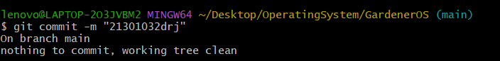
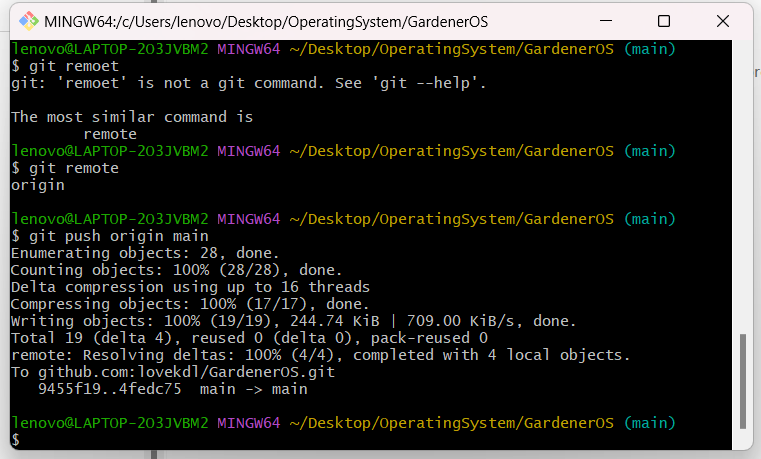
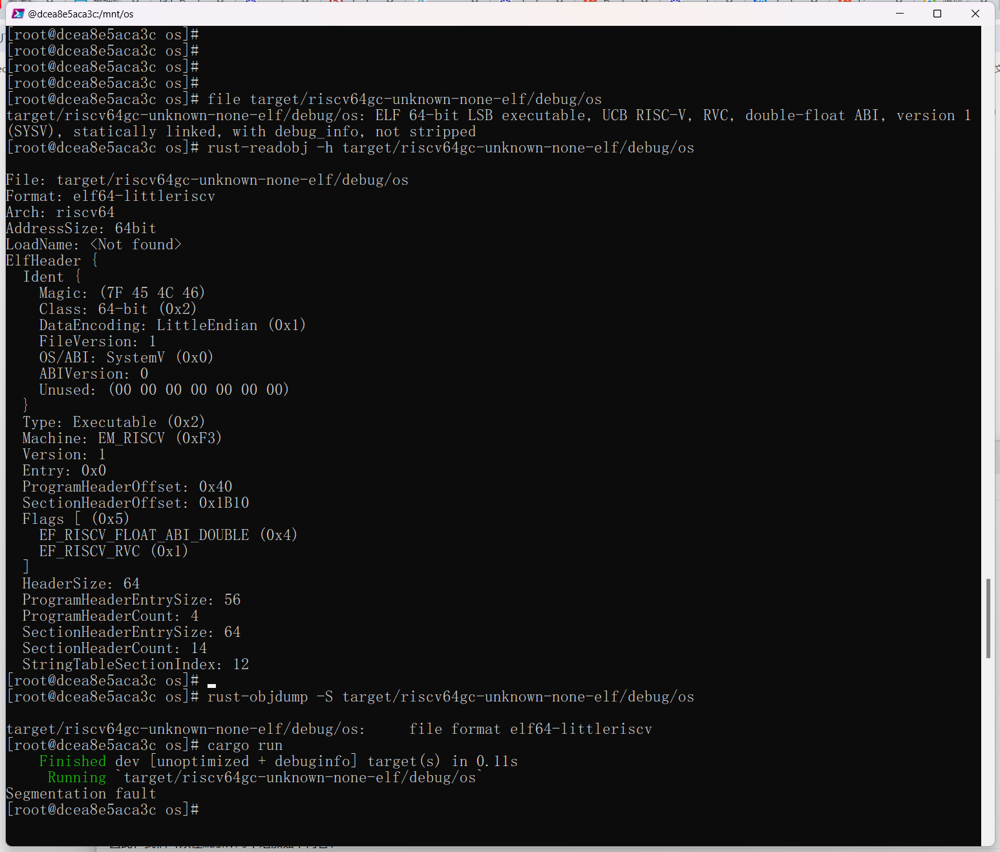
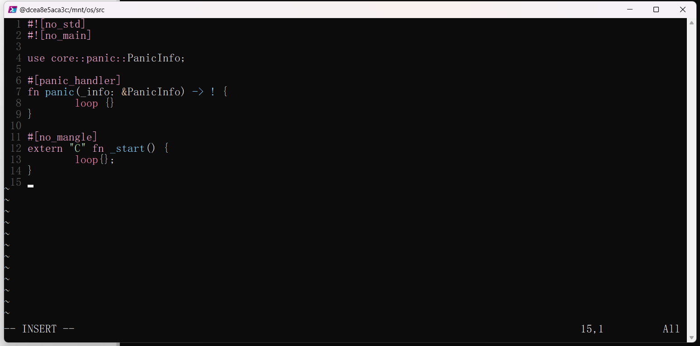
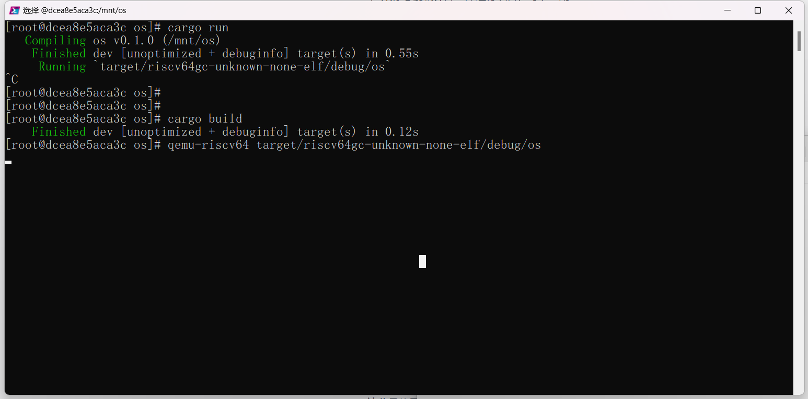
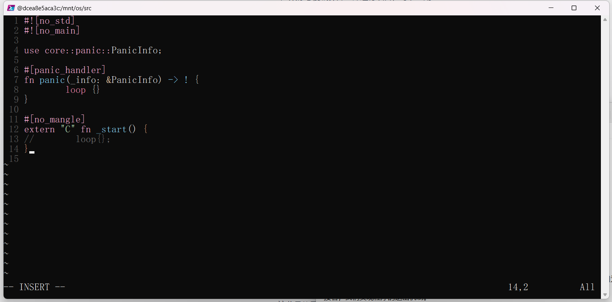
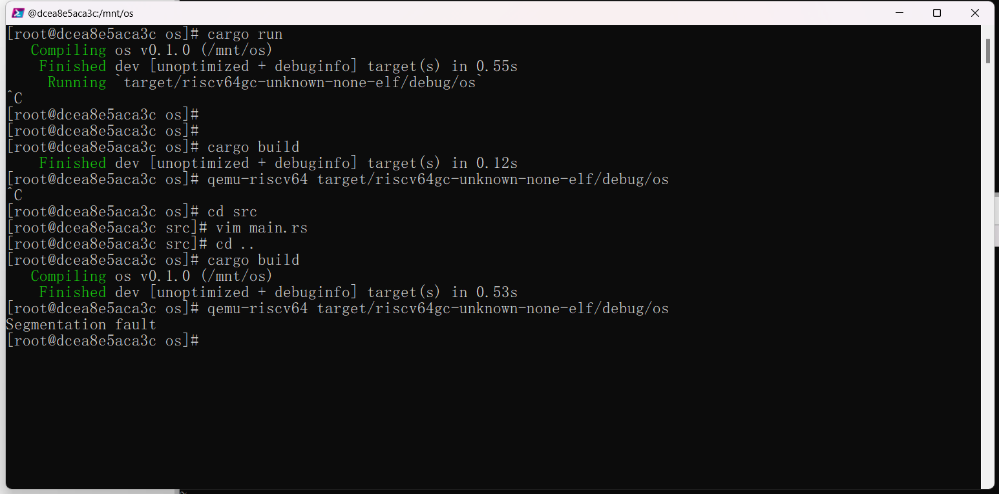
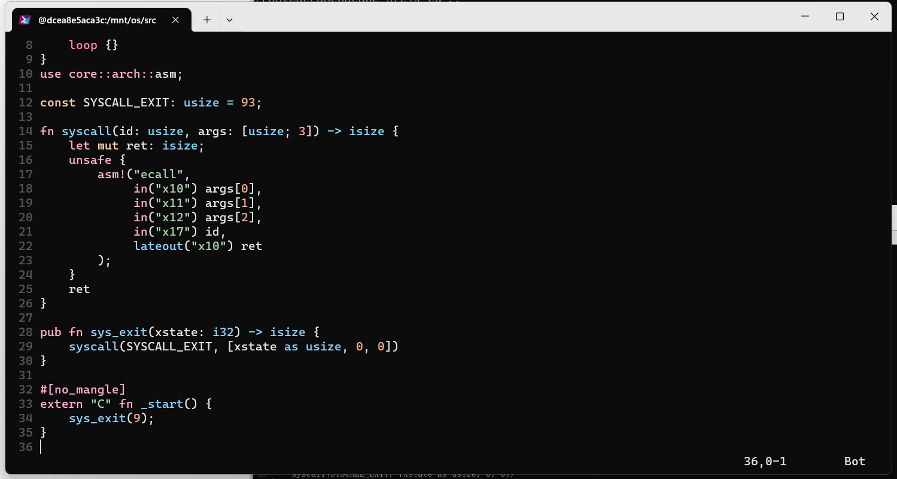
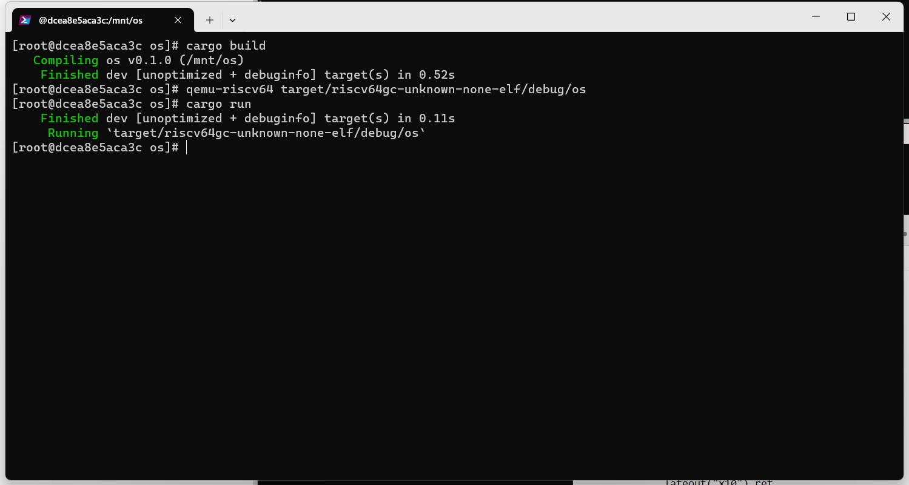
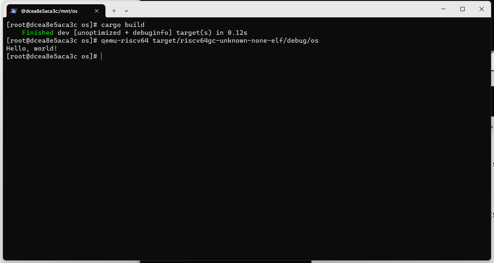

# 操作系统实验1

> 邓人嘉 21301032

### 一、实验步骤

#### 1.1 创建一个Rust项目

* 进入mnt目录，执行"cargo new os --bin"
  

* cd os
  cargo build
  cargo run

  

#### 1.2 移除标准库依赖

* 修改target为riscv64
  
  
* 
  
* 安装相关软件包
  
* 
* git提交
  

* 执行命令分析移除标准库后的独立可执行程序。

#### 1.3 用户态可执行的环境

* 增加入口函数
  

* 编译运行
  

* 去掉loop尝试
  

* 实现退出机制
  
  

* 实现输出支持

  

  

