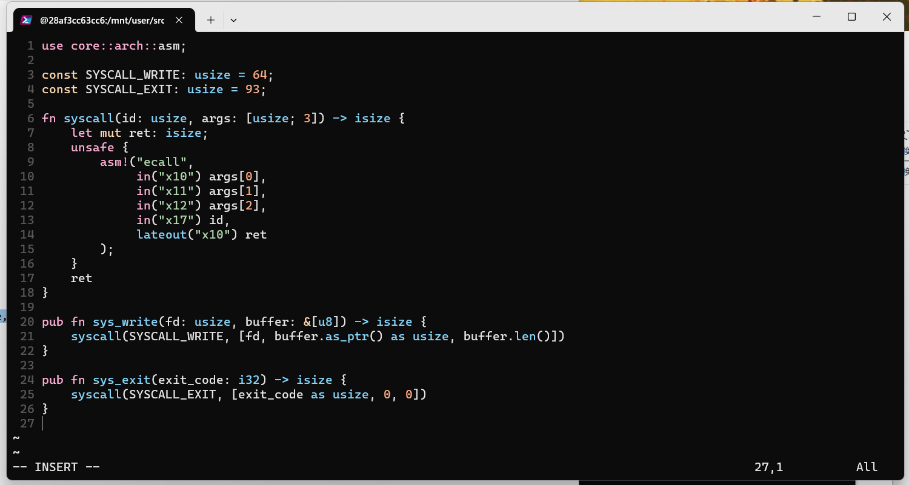
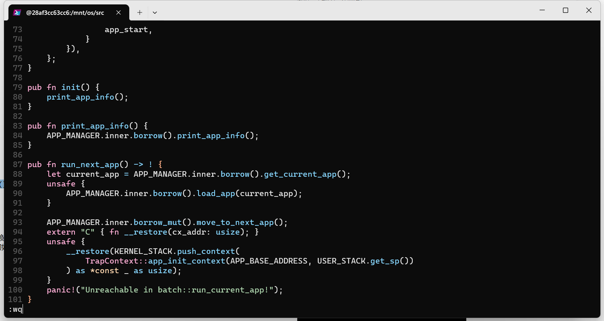

# 操作系统实验2

> 邓人嘉 21301032

### 一、实验步骤

#### 1.1 设计和实现应用程序

* 创建user目录
  

* 实现应用程序与系统约定的两个系统调用sys_write和sys_exit

  * syscall.rs:
    
  * lib.rs:

* 实现格式化输出

  * 把 Stdout::write_str 改成基于 write 的实现，console.rs:
    
  * 实现语义支持。lang_items.rs:
    

* 应用程序内存布局

  * 将应用程序的起始物理地址调整为 0x80400000。
    user/src/linker.ld：
    
    user/.cargo/config：

    

* 最终形成运行时库lib.rs

  * 定义用户库的入口点 _start。在lib.rs增加的代码：
    

* 实现多个不同的应用程序

  * 基于上面的模板，可以实现多个不同的应用程序
  * user/src/bin/00hello_world.rs:
    
  * /user/src/bin/01store_fault.rs:
    
  * /user/src/bin/02power.rs
    

* 编译生成应用程序二进制码

  * 编写Makefile文件，user/Makefile内容如下：
    
  * 执行make build 编译
    
  * 使用qemu-riscv64执行编译生成的程序
    

#### 1.2 链接应用程序到内核

* 在os文件夹中创建build.rs以生成专门用于链接的脚本文件link_app.S
  

  

#### 1.3 找到并加载应用程序二进制码

* 在os目录下实现一个batch子模块，创建os/src/batch.rs（其主要功能是保存应用程序的数据及对应的位置信息，以及当前执行到第几个应用程序。同时，也会初始化应用程序所需的内存并加载执行应用程序。）
  
  
* 修改os/Cargo.toml配置文件，在[dependencies]下增加如下内容：
  lazy_static = { version = "1.4.0", features = ["spin_no_std"] }
  

#### 1.4 实现用户栈和内核栈

* 在batch.rs中增加内容
  

* 实现TrapContext。os/src/trap/context.rs：
  

  

#### 1.5 实现trap管理

* Trap 上下文的保存与恢复
  * os/src/trap/mod.rs：
    
  * os/src/trap/trap.S：
    
  * os/src/trap/trap.S编写 __restore
    
* Trap 分发与处理
  * 实现trap_handler 函数完成Trap的分发和处理
    os/src/trap/mod.rs：
    
  * 因为引入了riscv库，所以需要修改配置文件Cargo.toml，在[dependencies]下增加内容：
    
* 系统调用处理
  
  * os/src/syscall/mod.rs：
    
  * os/src/syscall/fs.rs
    
  *  os/src/syscall/process.rs
    

#### 1.6 执行应用程序

* 为TrapContext实现app_init_context
  os/src/trap/context.rs：
  

#### 1.7 修改main.rs

* 修改main.rs修改新实现的模块。
  
* make run 运行查看结果：
  
  三个程序都执行成功。

### 二、思考问题

#### 2.1 分析应用程序的实现过程，并实现一个自己的应用程序

* 实现过程：

  * 首先在user文件夹中创建应用程序的执行环境
  * syscall.rs实现应用程序所需要的所有系统调用（sys_write和sys_exit）
  * console.rs实现格式化输出（标准输出）
  * lang_items.rs实现语义支持（对panic的处理）
  * linker.ld设置内存布局（设置起始物理地址，应用程序会被加载到这个物理地址上运行，从而进入用户库的入口点，并会在初始化之后跳转到应用程序主逻辑）
  * 在lib.rs中定义用户库的入口点_start
  * 在bin文件夹下编写应用程序的代码
  * 通过Makefile文件编译运行程序

* 实现一个自己的应用程序

  * 实现了一个$O(nlogn)$的求小于等于n的所有素数的程序。
    03primes.rs：
    

    

#### 2.2 分析应用程序的链接、加载和执行过程

* 链接
  * 通过linker.ld，将应用程序的起始物理地址调整为 0x80400000，通过build.rs生成用于链接的脚本文件link_app.S,实现应用程序的链接部分。
* 加载
  * 在os/src/batch.rs中实现了batch子模块，初始化应用程序所需的内存（即将应用程序的二进制码放入内存中）。
* 执行
  * batch子模块也完成了应用程序的执行，保存了应用程序的数据及对应的位置信息，以及当前执行到第几个应用程序，并且执行当前加载完成的应用程序。

#### 2.3 分析Trap是如何实现的

* trap用于处理系统调用
* 在os/src/trap/context.rs中定义了TrapContext，存储 Trap 发生时需要保存的物理资源内容。
* 在触发系统调用的时候，触发trap，从用户态切换到内核态。
* __alltraps来将trap上下文保存在内核栈上。
* 调用trap_handler实现trap的处理。
* 处理完毕后，调用__restore恢复，使用sret指令从内核态返回到用户态。

### 三、git截图

* git截图
  
