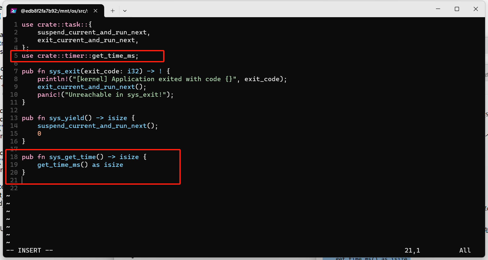
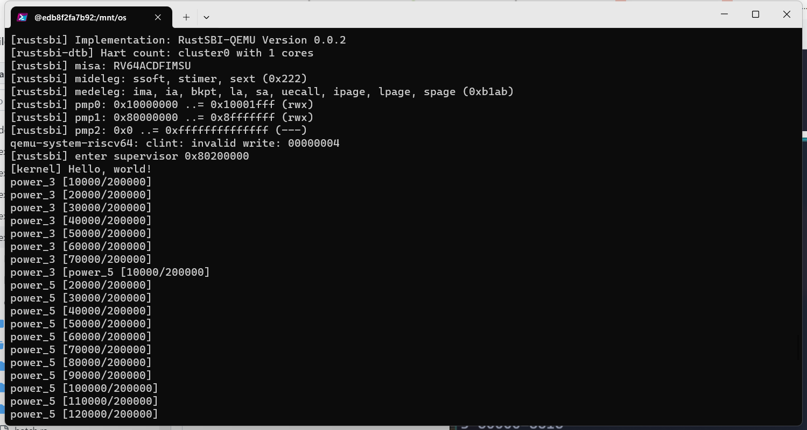

# 操作系统实验4

> 邓人嘉 21301032

### 一、实验步骤

#### 1.1 时钟中断与计时器

* 实现timer子模块获取mtime值。
  os /src/timer.rs：
* 在sbi子模块实现设置mtimecmp的值，并在timer子模块进行封装。
  os/src/sbi.rs：
  os /src/timer.rs：
  
* timer子模块实现以毫秒为单位返回当前计数器的值
  
* 在config.rs中添加CLOCK_FREQ=12500000常量
* 修改os/src/syscall子模块，增加get_time系统调用的实现。并在mod.rs增加了get_time系统调用的处理。
  os/src/syscall/process.rs：

#### 1.2 修改应用程序

* 增加get_time系统调用
  * 在user/src/syscall.rs增加get_time系统调用
    
  * 在user/src/lib.rs增加get_time用户库的封装
* 实现新的测试应用
  * 按照实验手册分别实现00power_3.rs，01power_5.rs，02power_7.rs以及03sleep.rs四个测试应用程序。

#### 1.3 抢占式调度

* 在os/src/trap/mod.rs中实现抢占式调度。
  按照手册修改代码即可，不具体截图了。
* main.rs添加初始化的操作

#### 1.4 运行结果

* 
* 
* 
* 

### 二、思考问题

#### 2.1 分析分时多任务是如何实现的。

* 在timer.rs中实现mtime的获取，在sbi子模块设置mtimecmp的值，当mtime超过mtimecmp时需要触发一次时钟中断。
* 在trap子模块中使用set_stimer操作系统能够定时中断应用程序。在中断后调用suspend_current_and_run_next()来中断当前程序，并把资源分配给下一个应用程序。

#### 2.2 分析抢占式调度是如何设计和实现的。

* 抢占式调度是基于时钟中断的，中断会周期性发起，当前正在运行的应用程序会被迫让出CPU权限。
* 中断发生时，操作系统会强制切换到下一个任务的上下文，具体是在trap子模块的suspend_current_and_run_next中执行的。

#### 2.3 对比上个实验实现的协作式调度与本实验实现的抢占式调度。

* 协作式调度程序需要通过yield来主动让出cpu权限，而抢占式调度可以通过yield主动让出cpu权限，也可以被迫等待时钟中断，被强制让出cpu权限。
* 协作式调度可能存在一个程序一直堵塞后面的程序，而抢占式调度中即使当前程序是死循环也会因为时间到了而被迫让出cpu。

### 三、git截图

* git截图(https://github.com/lovekdl/GardenerOS)
  
