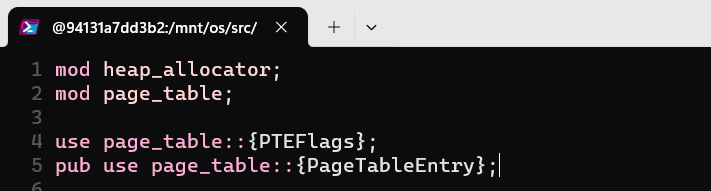
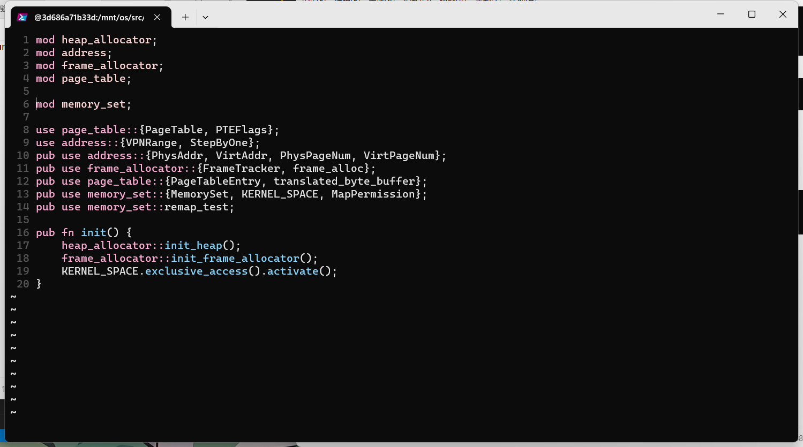

# 操作系统实验6

> 邓人嘉 21301032

### 一、实验步骤

#### 1.1 在内核中支持动态内存分配

* Cargo.toml中增加依赖（os/Cargo.toml）
* 在main.rs中引入alloc库的依赖（os/src/main.rs）
  
* 根据alloc留好的结构提供全局动态内存分配器，并处理动态内存分配失败的情况（os/src/mm/heap_allocator.rs）
  
* 在main.rs中增加处理动态内存分配失败的情况（os/src/main.rs）
  
* 实现测试动态内存分配（os/src/mm/heap_allocator.rs）
  
* 封装heap_allocator（os/src/mm/mod.rs）
  
* 在main.rs中对mm进行初始化
  
* 修改config.rs，添加：
  

#### 1.2 实现虚拟地址与物理地址的基本定义

* 定义所需要的基本数据结构，包括物理地址、虚拟地址、物理页号、虚拟页号（os/src/mm/address.rs）
* 实现上述这些类型和usize之间的相互转换。
  
* 实现地址和页号之间的相互转换。
  
* 实现查询索引等其他内容。
  

#### 1.3 定义页表项数据结构

* 实现页表项中的标志位PTElages
  * os/src/main.rs
    
  * os/src/mm/page_table.rs
    
  * 在配置文件中增加bitflgs的依赖。（os/Cargo.toml）
    
  * 实现PageTableEntry。（os/src/mm/page_table.rs）
    
  * 修改src/mm/mod/rs
    

#### 1.4 实现物理帧的管理和分配

* 设置物理内存的终止地址。（os/src/config.rs）
  
* 实现物理帧管理。（os/src/mm/frame_allocator.rs）
  
* 增加sync模块
  * os/src/sync/up.rs
  * os/src/sync/mod.rs
    
  * /os/src/main.rs增加sync模块。
    
* 物理帧管理测试
  * os/src/config.rs
  * os/src/mm/mod.rs
    
  * 测试结果

#### 1.5 多级页表管理

* 实现页表的基本数据结构。（os/src/mm/page_table.rs）
  
* 实现建立和拆除虚实地址之间的映射关系。（os/src/mm/page_table.rs）
  
* 实现手动查询页表的方法。（os/src/mm/page_table.rs）
  

#### 1.6 实现地址空间抽象

* 实现地址空间抽象
  * 首先，以逻辑段MapArea描述一段连续地址的虚拟内存。（os/src/mm/memory_set.rs）
  * 接着，用MapType描述逻辑段内所有虚拟页号映射到物理页帧的方式。（os/src/mm/memory_set.rs）
  * 利用MapPermisssion控制逻辑段的访问方式，其是页表项标志位PTEFlags的子集（os/src/mm/memory_set.rs）
    
  * 实现地址空间，也就是一系列有关联的逻辑段（os/src/mm/memory_set.rs）
    
  * 实现MemorySet的方法（os/src/mm/memory_set.rs）
    
  * 实现MapArea（os/src/mm/memory_set.rs）
    

* 实现创建内核地址空间的方法new_kernel。(os/src/mm/memory_set.rs)

  此处容器id更换了是因为我重装了docker，之前的容器丢失了。所以重新导入镜像，创建了新的容器。
  

* 实现应用地址空间

  * 所有应用使用同一个链接脚本(user/src/linker.ld )
    
  * 修改精简loader子模块(os/src/loader.rs)
    
  * 还需要解析ELF格式的数据，从而得到一个完整的应用地址空间(os/src/mm/memory_set.rs)
    
  * 在配置文件Cargo.toml增加依赖(os/Cargo.toml)
    
  * 实现memory_set子模块增加代码(os/src/mm/memory_set.rs)
    
  * os/src/config.rs
    

#### 1.7 实现基于地址空间的分时多任务

* 建立基于分页模式的虚拟地址空间
  * 创建内核地址空间。(os/src/mm/memory_set.rs)
    
  * 在rust_main中进行内存管理子系统的初始化(os/src/mm/mod.rs)
    
  * 检查内核地址空间的多级页表设置(os/src/mm/memory_set.rs)
    
* 实现跳板机制
  * 扩展Trap上下文(os/src/trap/context.rs)
    
  * 实现地址空间的切换(os/src/trap/trap.S)
    
  * 将 trap.S 中的整段汇编代码放置在 .text.trampoline 段，并在调整内存布局的时候将它对齐到代码段的一个页面中。(os/src/linker.ld)
    
* 加载和执行应用程序
  * 修改任务子模块，并更新任务控制块的管理。(os/src/task/task.rs)
    
  * os/src/config.rs
    
  * 在内核初始化的时候，需要将所有的应用程序加载到全局应用管理器中。同时，也要修改TaskManager的实现。(os/src/task/mod.rs)
    
  * 修改/os/src/task/switch.S
    
  * 修改switch.rs
    
* 改进Trap的处理
  * 首先修改init函数。然后再trap_handler的开头增加set_kernel_trap_entry。同时，在处理完trap后还要调用trap_return 返回用户态。(os/src/trap/mod.rs)
    
  * 在每一个应用程序第一次获得CPU权限时，内核栈顶放置在内核加载应用的时候构造的一个任务上下文。(os/src/task/context.rs)
    
* 改进sys_write的实现
  * 由于地址空间的隔离，sys_write无法直接方法应用空间的数据。为此，页表page_table提供一个将应用地址空间的缓冲区转化为内核地址空间可以直接访问的辅助函数。(os/src/mm/page_table.rs)
    
  * 修改sys_write系统调用。(os/src/syscall/fs.rs)
    

#### 1.8 修改应用程序

* 删除user/src/lib.rs中的clear_bss()
* 删除build.py
  

#### 1.9 修改main.rs

* os/src/main.rs
  
* 修改os/build.rs
  

#### 1.10 运行结果

### 二、思考问题

#### 2.1 分析虚拟地址和物理地址的设计与实现；

* 虚拟地址和物理地址的数据结构的基本定义在os/src/mm/address.rs。
* 在os/src/mm/address.rs中实现和usize之间的相互转换、地址和页号之间的相互转换。
* 在os/src/mm/page_table.rs中通过map方法建立虚实地址之间的映射关系，通过unmap方式实现了拆除映射关系。

#### 2.2 分析物理帧是如何管理与分配的；

* 在os/src/mm/frame_allocator.rs中，FrameTracker记录了物理帧的信息，包括页号，实现了FrameAllocator，用于分配和回收物理帧(alloc和dealloc)。
* 利用StackFrameAllocator类型的FrameAllocatorImpl实现栈管理物理页。实现frame_alloc和frame_dealloc分配和回收物理帧。
* 物理帧的分配先通过recycled检查回收的物理帧，优先从已经回收的列表中取出，如果没有回收的物理帧， 就将当前位置设为新的物理帧。
* 物理帧的回收，首先检测物理帧是否合法，并放入recycled中。

#### 2.3 分析内核的地址空间以及应用程序的地址空间是如何实现的；

* 实现在os/src/mm/memory_set子模块
* 定义MapArea结构体，存储连续空间的虚拟页的范围、映射方式、映射权限。
* 实现memory_set方法管理操作体统的地址空间。
* 内核地址空间
  * 实现new_kernel方法，用于创建内核地址空间。
  * 定义一个memory_set用于管理内核地址空间。
  * 将多个MapArea 放进memory_set，实现内核地址空间的分配和管理。
* 应用地址空间
  * user/src/linker.ld 中定义定义应用程序在内存中的布局，基础地址BASE_ADDRESS设为0。
  * 在MemorySet中定义from_elf方法，用于读取elf格式的可执行文件。解析页的大小和起始终止位置，放入map_area中。将map_area放入memory_set中管理。

#### 2.4 分析基于地址空间的分时多任务是如何实现的；

* 在os/src/mm/memory_set.rs中创建统一的内核地址空间。
* 在rust_main中进行内存管理子系统的初始化，包括heap_allocator和frame_allocator并激活内核空间。
* 实现remap_test方法，检查内核地址空间的多级页表设置
* 扩展Trap上下文，实现地址空间的切换，建立跳板页面。在调整内存布局的时候将trap对齐到代码段的一个页面中。
* 通过 TaskControlBlock 任务管理器来管理每个任务的信息，并实行上下文切换。
* 实现TaskManager，在内核初始化的时候，需要将所有的应用程序加载到全局应用管理器中。

#### 2.5 编写新的应用程序并测试验证结果。

* 实现了04power_9.rs，计算9的210000次方mod998244353
  
* 实现了05_fac.rs，计算300000的阶层
  
* 运行结果
  
  
  
* 验证成功

### 三、git截图

* git截图(https://github.com/lovekdl/GardenerOS)

### 四、 其它说明

* 中途容器id更换是因为重装了docker，之前的容器丢失了。所以重新导入镜像，创建了新的容器。
