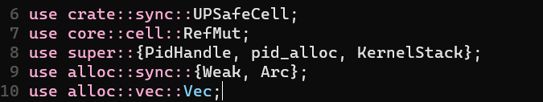
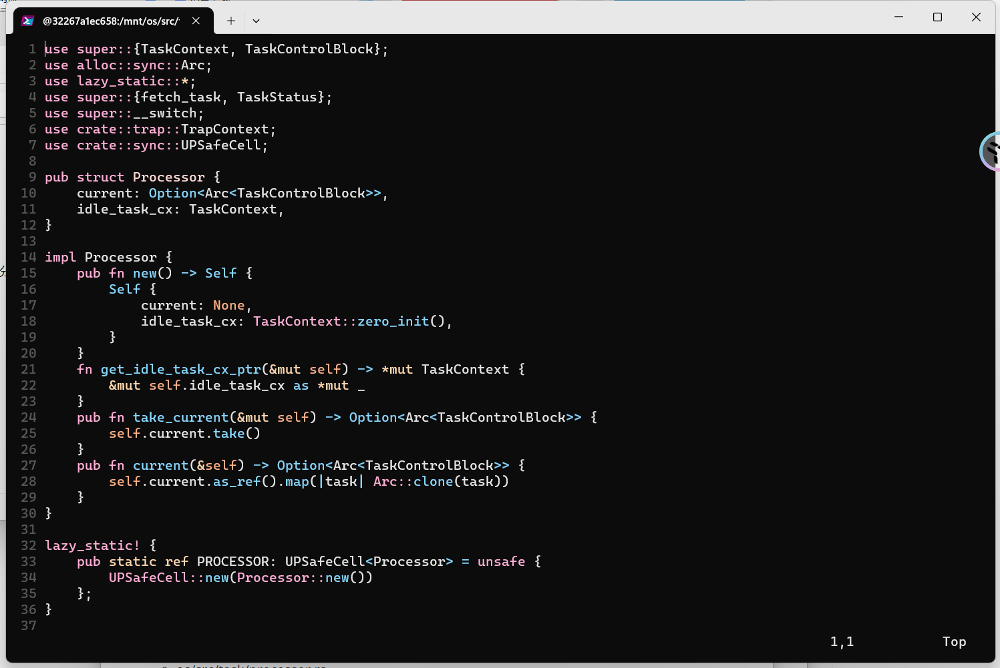
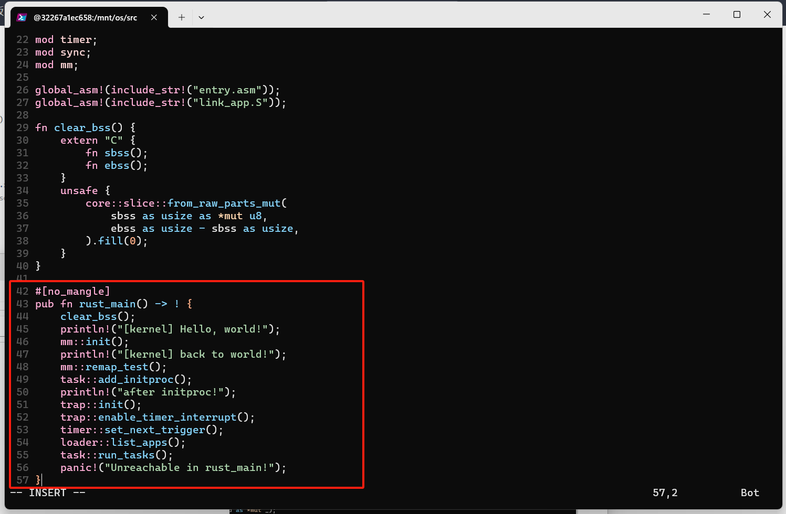

# 操作系统实验6

> 邓人嘉 21301032

### 一、实验步骤

#### 1.1 修改应用程序

* 增加重要的系统调用
  * user/src/syscall.rs
  * 在user/src/lib.rs封装系统调用为应用程序使用的形式
    

* 实现用户初始程序initproc
  * user/src/bin/initproc.rs

* 实现shell程序
  * 首先基于sys_read系统调用封装能够从标准输入读取一个字符的函数getchar。(user/src/console.rs )
    
  * 因为Rust的可边长字符串类型String基于动态内存分配，因此还需要在用户库user_lib中支持动态内存分配。(usr/src/lib.rs)
    

#### 1.2 在内核中增加系统调用

* 修改os/src/syscall/mod.rs增加fork、waitpid、getpid、read系统调用。
  
* 修改os/src/syscall/fs.rs，实现sys_read系统调用。
  
* 修改os/src/syscall/process.rs实现其他系统调用
  

#### 1.3 应用的链接与加载

* 基于名字的应用链接
  * 因为实现exec系统调用需要根据应用程序的名字获取ELF格式的数据，因此需要修改链接和加载接口。修改编译链接辅助文件os/build.rs。
    
* 基于名字的应用加载
  * 应用加载子模块loader.rs会用一个全局可见的只读向量APP_NAMES按照顺序吧所有应用的名字保存在内存中。（os/src/loader.rs）
    

#### 1.4 进程标识符与内核栈

* 实现进程标识符
  * 进程标识应当是唯一的，我们将其抽象为一个PidHandle类型。(os/src/task/pid.rs)
    
  * 类似于之前的物理页帧的管理，我们实现一个进程标识符分配器PID_ALLOCATOR。(os/src/task/pid.rs)
    
  * 我们还需要封装一个全局的进程标识分配接口pid_alloc。(os/src/task/pid.rs)
    
  * 同时，为了允许资源的自动回收，还需要为PidHandle实现Drop Trait。(os/src/task/pid.rs)
    
* 在内核栈中保存进程标识符
  * 重新定义内核栈。(os/src/task/pid.rs)
    
    
  * 同时也需要实现KernelStack 的Drop Trait以便KernelStack生命周期结束时回收相应的物理页帧。
    
  * 相应的，还需要修改os/src/mm/memory_set.rs
    

#### 1.5 修改实现进程控制块

* 修改原本的TaskControlBlock实现进程控制块的功能。
  
  
  
* TaskControlBlockInner
  
* 同时修改TaskStatus的状态。
  

#### 1.6 实现任务管理器

* 修改任务管理器，将部分任务管理功能移到处理器管理中。(os/src/task/manager.rs)
  

#### 1.7 增加处理器管理结构

* 实现处理器管理结构Processor，完成从任务管理器分离的维护CPU状态的部分功能。
  * os/src/task/processor.rs
    
    

#### 1.8 创建初始进程

* 内核初始化完成后，将会调用task子模块的add_initproc将初始进程initproc加入任务管理器。在这之前要初始化初始进程的进程控制块。
  * 首先删除os/src/task/mod.rs中TaskManager和TaskManagerInner相关的实现。然后增加如下代码：(os/src/task/mod.rs)
    

#### 1.9 进程调度机制

* 通过调用 task 子模块提供的 suspend_current_and_run_next 函数可以暂停当前任务并切换到另外一个任务。因为进程概念的引入，其实现需要更改。(os/src/task/mod.rs)
  

#### 1.10 进程的生成机制

* 在内核中只有初始进程initproc是手动生成的，其他的进程由初始进程直接或间接fork出来，然后再调用exec系统调用加载并执行可执行文件。所以，进程的生成机制由fork和exec两个系统调用来完成。
* 实现fork系统调用最关键的是为子进程创建一个和父进程几乎相同的地址空间。具体实现如下。
  * MapArea
    
  * MemorySet
    
  * 接着，实现 TaskControlBlock::fork 来从父进程的进程控制块创建一份子进程的控制块。(os/src/task/task.rs)
    
  * 实现exec系统调用。(os/src/task/task.rs)
    
  * os/src/mm/page_table.rs
    
    
  * os/src/mm/address.rs
    
  * 在sys_exec系统调用后，trap_handler原来的上下文cx失效了。为此，在syscall分发之后，还需要重新获取trap上下文。os/src/mm/mod.rs
    

#### 1.11 进程资源回收机制

* 当应用调用 sys_exit 系统调用主动退出或者出错由内核终止之后，会在内核中调用 exit_current_and_run_next 函数退出当前进程并切换到下一个进程。
* 相比之前的实现，exit_current_and_run_next增加了一个退出码作为参数。(os/src/mm/memory_set.rs)
  
* os/src/task/mod.rs
  
* 最后，修改main.rs。
  

##### 1.12 运行结果

### 二、思考问题

#### 2.1 分析应用的链接与加载是如何实现的；

* 基于名字的应用链接
  * 在build.rs中，通过应用名字链接对应的应用。

* 基于名字的应用加载
  * 在loder.rs子模块中使用APP_NAMES这个全局的只读向量，把所有应用的名字加载到内存中。
  * 实现了根据应用名调取应用数据的函数get_app_data_by_name()

* 根据应用名获取到的数据是ELF格式的，以实现exec系统调用

#### 2.2 分析进程标识符、进程控制块是如何设计和实现的；

* 进程标识符在os/src/task/pid.rs中实现。
  * 实现了PidAllocator数据结构，定义了alloc、dealloc函数，用于分配、回收进程标识符
* 进程控制块在os/src/task/task.rs中实现。
  * 实现了TaskControlBlock数据结构，存储了进程的页号、空间大小、任务上下文信息、父进程、子进程等相关信息

#### 2.3 分析任务管理是如何实现的；

* 在os/src/task/manager.rs中实现任务管理器
  * 任务管理器以的队列方式存储任务
  * 队列采用FIFO的调度方式
  * 实现了add、fetch函数，用于添加任务到队尾、获取队头任务

#### 2.4 分析进程的调度、生成、以及进程资源的回收是如何实现的。

* 进程的调度os/src/task/mod.rs中实现
  * suspend_current_and_run_next函数。
  * 通过TCB，停止当前任务，将任务状态变为Ready，把任务放到任务队列的队尾
  * 调用schedule，运行下一个进程

* 进程是由初始进程initproc中fork出来的，然后exec进行加载和执行，所以进程生成机制由fork和exec两个系统调用来完成。
  * fork
    * 在os/src/mm/memory_set.rs中实现了为子进程创建一个和父进程几乎相同的地址空间
    * 在os/src/task/task.rs实现TaskControlBlock::fork， 从父进程的进程控制块创建一份子进程的控制块

  * exec
    * os/src/task/task.rs中的TaskControlBlock结构体中，实现了exec函数。

* 进程资源的回收
  * os/src/mm/memory_set.rs中添加self.areas.clear();回收空间
  * os/src/task/mod.rs修改exit_current_and_run_next函数进行释放空间等操作。
  * 父进程通过 sys_waitpid 系统调用来回收子进程的资源并收集子进程的信息

### 三、git截图

* git截图(https://github.com/lovekdl/GardenerOS)
  

### 四、 其它说明

* 中途容器id更换是因为重装了docker，之前的容器丢失了。所以重新导入镜像，创建了新的容器。
